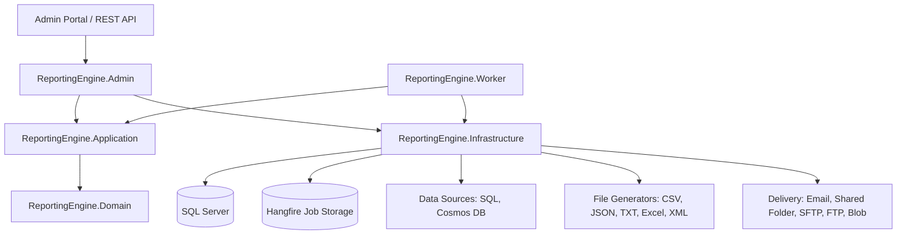
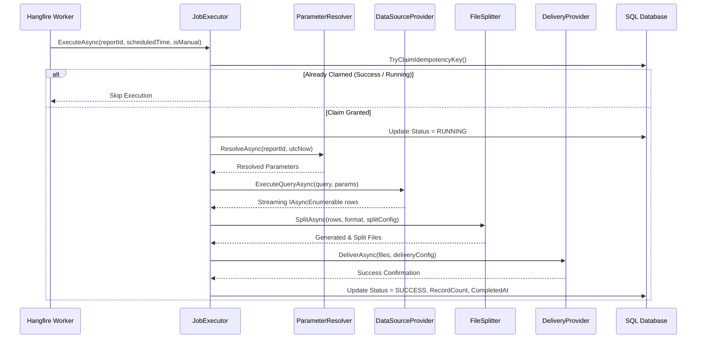

# Reporting Engine Architecture Blueprint

## Architectural Overview

The **Enterprise Reporting Engine** is designed using Clean Architecture principles to ensure high performance, maintainability, testability, and enterprise-grade resilience.

---

## Component Breakdown

### 1. Domain Layer (`ReportingEngine.Domain`)
Contains core domain models, business logic constants, and domain enums:
- **Entities**: `Customer`, `DataSource`, `Schedule`, `FileConfiguration`, `DeliveryConfiguration`, `ReportDefinition`, `ReportParameter`, `JobExecution`, `FileExecution`, `AuditLog`.
- **Enums**: `DataSourceTypes`, `FileFormats`, `DeliveryTypes`, `ScheduleTypes`, `ParameterTypes`, `JobExecutionStatuses`, `FileGenerationStatuses`, `FileDeliveryStatuses`.

### 2. Application Layer (`ReportingEngine.Application`)
Defines application interfaces, use cases, DTOs, and validation logic:
- Abstractions for Repositories, Data Source Providers, File Generators, Delivery Providers, Job Execution, and Parameter Resolution.
- FluentValidation validators for reports, data sources, schedules, and delivery configurations.

### 3. Infrastructure Layer (`ReportingEngine.Infrastructure`)
Contains all technical implementations:
- **Persistence**: `ReportingEngineDbContext` mapped using EF Core Fluent API to `RepScdhedularProject_*` tables.
- **Orchestration**: `JobExecutor` pipeline executing data extraction, parameter binding, file generation, splitting, compression, and delivery.
- **Background Jobs**: Hangfire job dispatching, recurring schedule synchronization, and exponential backoff retry filters.
- **Secret & Connection Resolution**: `SecretResolver` and `ConnectionStringResolver` abstractions for securely handling external credentials.

### 4. Admin Web Portal (`ReportingEngine.Admin`)
ASP.NET Core Web API with Swagger endpoints and Razor Pages Admin UI for configuring and managing customers, reports, schedules, and viewing execution logs and audit history.

### 5. Worker Service (`ReportingEngine.Worker`)
Dedicated Windows Service / Linux Daemon worker hosting the Hangfire processing server with configurable concurrency (`WorkerCount`).

---

## Database Schema & Naming Standards

All database tables follow the required `RepScdhedularProject_` prefix:

| Entity | Database Table Name | Key Primary Key |
|---|---|---|
| Customer | `RepScdhedularProject_Customer` | `CustomerId` |
| DataSource | `RepScdhedularProject_DataSource` | `DataSourceId` |
| Schedule | `RepScdhedularProject_Schedule` | `ScheduleId` |
| FileConfiguration | `RepScdhedularProject_FileConfiguration` | `FileConfigId` |
| DeliveryConfiguration | `RepScdhedularProject_DeliveryConfiguration` | `DeliveryConfigId` |
| ReportDefinition | `RepScdhedularProject_ReportDefinition` | `ReportId` |
| ReportParameter | `RepScdhedularProject_ReportParameter` | `ParameterId` |
| JobExecution | `RepScdhedularProject_JobExecution` | `ExecutionId` |
| FileExecution | `RepScdhedularProject_FileExecution` | `FileExecutionId` |
| AuditLog | `RepScdhedularProject_AuditLog` | `AuditId` |

---

## Execution Pipeline Lifecycle

---

## Resilience & Concurrency Model

1. **Idempotency**: Every job invocation evaluates `IdempotencyKey`. For scheduled runs, `sched:{ReportId}:{yyyyMMddHHmm}` prevents duplicate execution even across cluster failovers.
2. **Concurrency**:
   - Different reports run in parallel across worker threads.
   - The same report is protected from parallel execution via Hangfire `[DisableConcurrentExecution]`.
3. **Transient Error Handling**:
   - `SqlException` deadlock/timeout, network timeouts, and file IO exceptions trigger `RETRYING` status and Hangfire exponential backoff retry.
   - Configuration or query syntax errors trigger immediate `FAILED` status without infinite retries.
